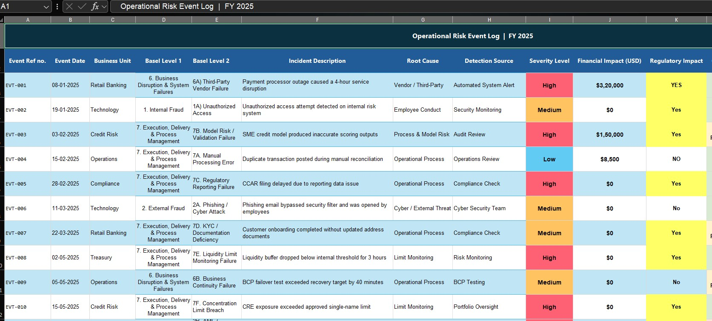
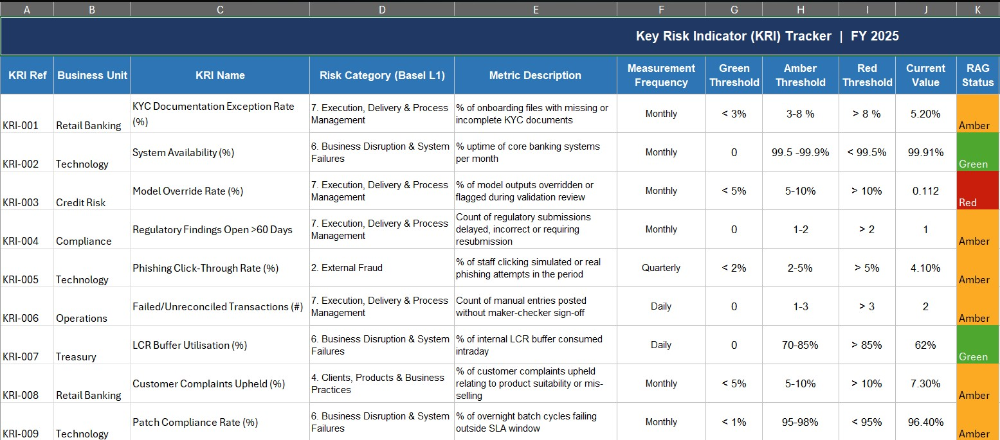
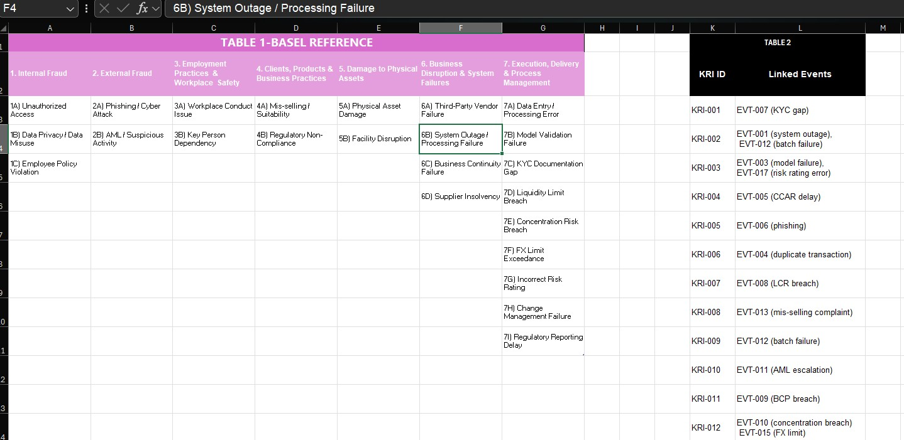
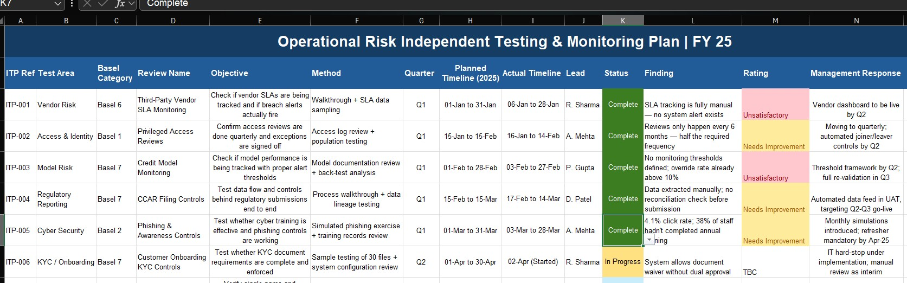

# Operational Risk Management Tracker — FY 2025

A self-initiated project built to demonstrate practical knowledge of **2nd Line of Defence (2LoD) Operational Risk Management**.

The project is structured around the **Basel II Operational Risk Event Classification Framework** and designed to simulate how a real-world ORM Independent Monitoring & Testing function operates across a financial institution.

---

# Project Objective

Most ORM learning stops at understanding concepts like KRIs, control testing, or Basel categories in theory.

This project was built to demonstrate the operational side of risk management by simulating:

- Operational risk event management
- KRI monitoring and breach escalation
- Independent testing activities
- Heat risk analysis
- Aggregated management reporting
- Basel event classification mapping

The workbook follows a connected risk flow:

```text
Risk Event → KRI Trigger → Independent Testing → Dashboard Reporting
```

This mirrors how operational risk functions work in practice.

---

# Workbook Structure

## 1. Risk Event Log

20 operational risk events logged across FY 2025.

### Includes:
- Basel Level 1 and Level 2 classification
- Business unit mapping
- Detection source
- Root cause analysis
- Severity assessment
- Financial impact
- Regulatory impact flag
- Case status
- Control gap identification

### Business Units Covered
- Retail Banking
- Technology
- Credit Risk
- Compliance
- Operations
- Treasury

---

## 2. KRI Tracker

12 Key Risk Indicators (KRIs) monitored using:

- Green / Amber / Red thresholds
- Breach logic
- Trend monitoring
- Remediation tracking

### Current Status
| Status | Count |
|---|---|
| Green | 3 |
| Amber | 7 |
| Red | 2 |

### Active Red KRIs
| KRI | Current Value | Threshold |
|---|---|---|
| Model Override Rate | 11.2% | 8% |
| BCP Recovery Time Variance | 40 mins | 30 mins |

Both KRIs have active remediation actions in progress.

---

## 3. Reference & Linkage Map

Two reference tables were built to improve traceability and governance.

### Table 1 — Basel Mapping
Full Basel Level 1 → Level 2 event hierarchy.

### Table 2 — KRI Linkage
Maps each KRI back to the operational risk event(s) that triggered it.

This ensures:
- Data lineage
- Logical traceability
- Risk aggregation visibility

---

## 4. Independent Testing Plan

14 independent monitoring and testing activities planned across Q1–Q4.

### Testing Methods Used
- Walkthrough testing
- Population sampling
- Back-testing
- Simulated phishing exercises
- Control validation testing

### Q1 Results
| Rating | Count |
|---|---|
| Unsatisfactory | 2 |
| Needs Improvement | 3 |

Q2–Q4 activities remain planned or in progress.

---

## 5. Dashboard & Risk Reporting

Built for senior management style reporting.

### Dashboard Components
- Pivot Table — Event Count by Basel Category
- Pivot Table — Financial Impact by Basel Category
- Heat Risk Matrix — Basel Category × Severity
- KRI RAG Status Chart

### Heat Risk Analysis
The heat map highlights:
- Event concentration
- Severity concentration
- Highest operational risk exposure areas

---

# Key Findings

## Basel 7 Dominates the Portfolio
- 50% of all events fall under:
  
  **Execution, Delivery & Process Management**

This indicates recurring process control weaknesses across business units.

---

## Highest Severity Concentration
Basel 7 also contains:
- 6 High severity events
- 2 Low severity events

Making it both:
- the most frequent category
- the highest impact category

---

## KRI Stress Indicators
- 2 KRIs currently in Red
- 7 KRIs in Amber

The portfolio remains under elevated monitoring but without widespread threshold breach.

---

## Financial Impact
| Metric | Value |
|---|---|
| Total FY2025 Loss Impact | $663,500 |
| Largest Single Event | $320,000 |

Largest event:
> Third-party vendor payment processor outage

---

## Open Critical Issues
4 events remain:
- Open
- Escalated
- Under management review

Including:
- AML structuring investigation
- Critical data privacy breach

---

# Skills Demonstrated

| Skill Area | Demonstrated Through |
|---|---|
| Basel II Event Classification | Risk Event Log |
| KRI Framework Design | Thresholds & RAG monitoring |
| 2LoD Independent Testing | Testing Plan |
| Risk Appetite Monitoring | Threshold breach tracking |
| Heat Risk Analysis | Basel × Severity matrix |
| Aggregated Risk Reporting | Dashboard reporting |
| Data Governance & Traceability | KRI linkage mapping |

---

# Screenshots

## Sheet 1 — Risk Event Log


---

## Sheet 2 — KRI Tracker


---

## Sheet 3 — Reference & Linkage Map


---

## Sheet 4 — Independent Testing Plan


---

## Sheet 5 — Dashboard


---

# Tools & Frameworks Used

## Tools
- Microsoft Excel
- Pivot Tables
- Conditional Formatting
- Data Validation
- COUNTIF / COUNTA formulas

## Frameworks & Methodologies
- Basel II Operational Risk Framework
- 2nd Line of Defence (2LoD) ORM methodology
- Independent Monitoring & Testing principles

---

# About This Project

This project was built as a portfolio piece while preparing for Operational Risk Management analyst roles.

### Important Notes
- Entirely self-initiated
- No external template used
- Data is fictional
- Scenarios are designed to reflect realistic ORM situations

### Simulated Risk Scenarios Include
- Vendor failures
- Model risk events
- AML alerts
- Cyber incidents
- BCP breaches
- Regulatory reporting failures

---

# Future Enhancements

Potential future additions:
- Power BI dashboard integration
- SQL-backed event repository
- Automated KRI threshold alerts
- Python-based risk trend analysis
- Loss forecasting models

---

# Author

**Aishwarya Sivakumar**

- LinkedIn: linkedin.com/in/aishwarya-sivakumar1385


---

> If you work in Operational Risk or Risk Management and spot anything inaccurate or unrealistic, feedback is genuinely welcome.
